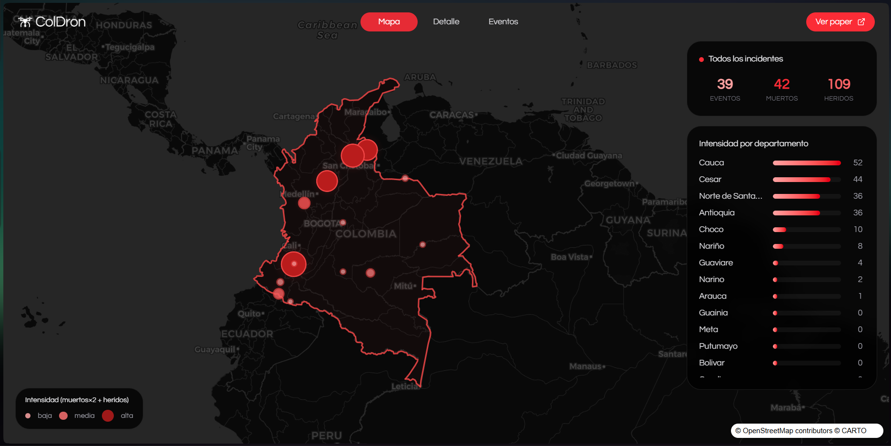
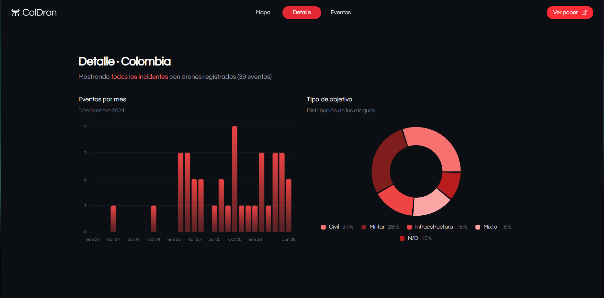
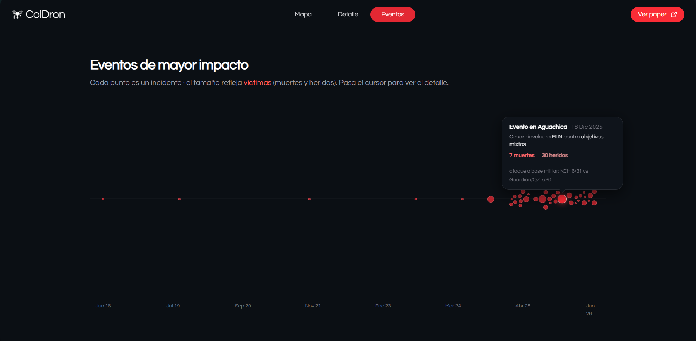

# Observatorio de datos ColDron de los ataques de drones en Colombia.

Visualización web de los ataques con drones documentados en Colombia. Es la cara pública del dataset abierto **ColDron** y del proyecto de gobernanza de armas autónomas de **AI Safety Colombia (AISCOL)**, en colaboración con Apart Research.

> En Colombia los grupos armados ilegales ya atacan con drones comerciales modificados y han herido y matado a civiles. ColDron documenta ese daño y prueba empíricamente que **el 100% de los ataques son operados por un humano, sin autonomía**. Esa es la ventana de prevención: fijar las reglas de control humano antes de que la autonomía llegue al conflicto.



## Qué muestra

La página tiene tres secciones, navegables desde el header (con scroll-snap a pantalla completa):

### 🗺️ Mapa
El mapa oscuro de Colombia con los 39 incidentes georreferenciados. El tamaño de cada punto refleja la intensidad (muertos·2 + heridos) y el panel lateral resume totales (eventos, muertos, heridos) y el ranking de intensidad por departamento. Soporta zoom y desplazamiento con gestos del ratón.

### 📊 Detalle
Estadísticas agregadas del dataset: **eventos por mes** desde enero 2024 (gráfico de barras) y **distribución por tipo de objetivo** (civil, militar, infraestructura, mixto, N/D) en una dona.



### 📈 Eventos
Línea de tiempo de los eventos de mayor impacto. Cada punto es un incidente y su tamaño refleja el número de víctimas; al pasar el cursor se ve el detalle (lugar, fecha, perpetrador, objetivo, muertos y heridos).



## Datos

La fuente es [`public/coldron_seed.csv`](public/coldron_seed.csv), el dataset ColDron de incidentes documentados a partir de fuentes públicas (prensa, reportes del Ministerio de Defensa, ONU/OCHA y CICR).

## Stack

- **Next.js 16** (App Router) · **React 19** · **TypeScript**
- **Tailwind CSS v4** + componentes **shadcn/ui** (radix-ui)
- **MapLibre GL** para el mapa
- **Recharts** para los gráficos

## Desarrollo

```bash
pnpm install
pnpm dev        # http://localhost:3000
```

Otros comandos: `pnpm build` (producción), `pnpm start` (servir build), `pnpm lint`.

**Autores:** Leonardo Párraga · Angie Giraldo · Víctor Gelves — AI Safety Colombia (AISCOL), con Apart Research.
